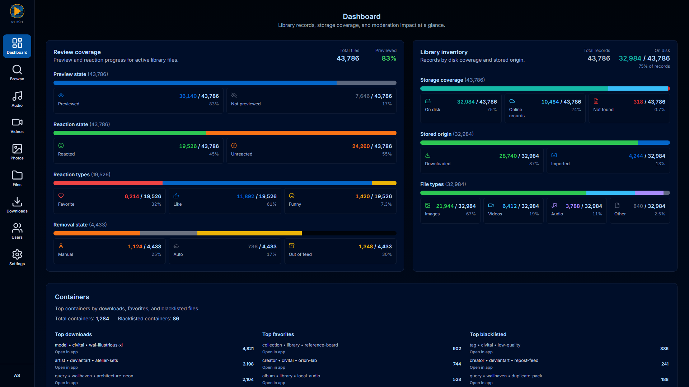
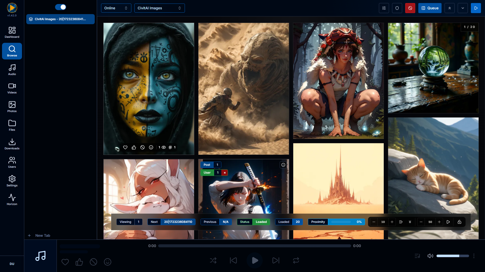
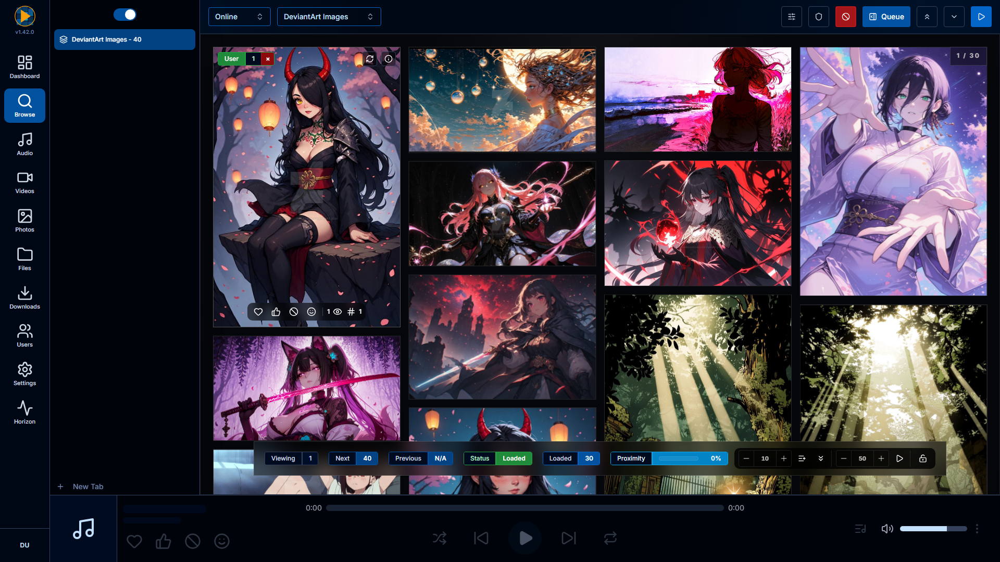
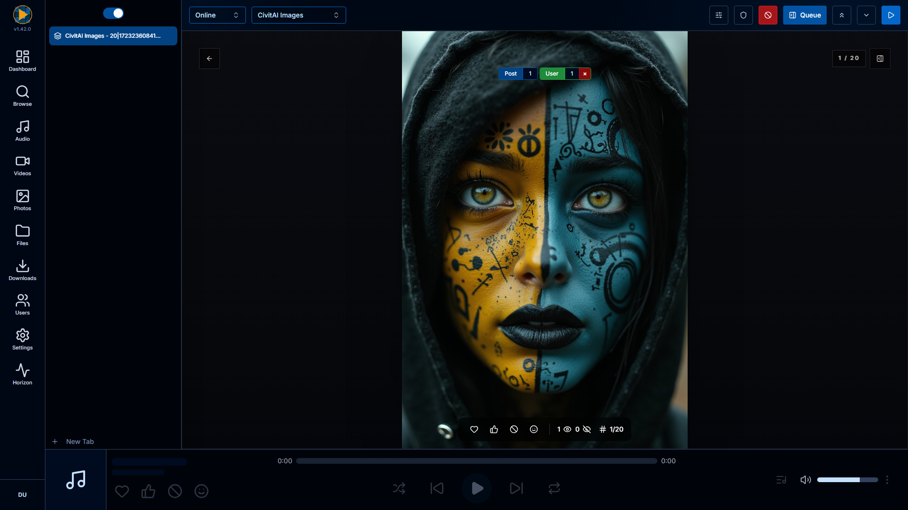

<p align="center">
    
</p>

<h1 align="center">Atlas</h1>

<p align="center">
    Private media library, feed triage, and personal archive operations.
</p>

<p align="center">
    <a href="https://youtu.be/g1Ogg5vivSM">Watch the demo video</a>
    ·
    <a href="docs/SETUP.md">Setup guide</a>
    ·
    <a href="docs/DEVELOPER_OVERVIEW.md">Developer overview</a>
</p>



## Triage noisy media feeds without losing the good stuff.

Atlas is a self-hosted workspace for moving through noisy media sources quickly: browse external feeds and local folders, react to what is worth keeping, auto-save the good items, and manage the private library that grows from those decisions.

It is not a traditional media library manager. Atlas is built for discovery, fast keep/nope workflows, moderation rules, background downloads, imports, metadata, and browser-native playback.

## What Atlas is for

- Fast browsing of image, video, and audio collections at scale
- One-click reactions to keep, discard, favorite, like, or blacklist items
- Background saves and transfer state for media worth keeping
- Moderation rules and blacklists that reduce repeats, spam, and low-signal results
- Local folder scans that bring existing files into managed Atlas storage
- Searchable playback-ready library views with posters, previews, and metadata

## Screenshots

### Browse and react

Open a source, sort or filter the feed, then work through media with reactions and keyboard shortcuts instead of slow form-heavy review.



### Compare sources and local files

Remote services and local folders share one browsing surface, with filters for type, reaction, transfer state, moderation, and random sampling.



### Review in full view

Use fullscreen review for focused decisions, quick reactions, original opens, and playback checks.



## Supported sources

Current public-home sources include:

- CivitAI images
- DeviantArt
- Wallhaven
- Local Atlas library files

More sources can be added as new collectors and adapters are built.

## Browser extension

Atlas includes a browser extension workflow for reacting and saving without leaving the source page. It handles source-page badges, batch reactions, transfer status, API-key-backed actions, and handoff into Atlas tabs.

## Imports and library management

Atlas can scan existing folders, queue imports, detect duplicates, rerun parsers, and bring unmanaged files into the same managed storage and metadata workflow as newly saved media.

## Documentation

- [Setup guide](docs/SETUP.md) — server-style install requirements and first-run steps
- [Developer overview](docs/DEVELOPER_OVERVIEW.md) — application structure, frontend routing, and API shape

## Development

Atlas is a Laravel 12 + Vue 3 + TypeScript application using Vite, Tailwind CSS v4, shadcn-vue/Reka UI primitives, Pest, Vitest, and Playwright.

Install dependencies:

```bash
composer install
npm install
```

Run the frontend dev server:

```bash
npm run dev
```

Build assets:

```bash
npm run build
```

Run frontend checks:

```bash
npm run lint
npm run typecheck
npm run test
```

Run backend checks:

```bash
php artisan test --compact
php vendor/bin/pint --dirty --test
```

Run the project gate:

```bash
npm run check
```

## Status

Atlas is an active private/self-hosted application. Expect the source adapters, import pipeline, metadata tools, and playback surfaces to evolve with real review workflows.
