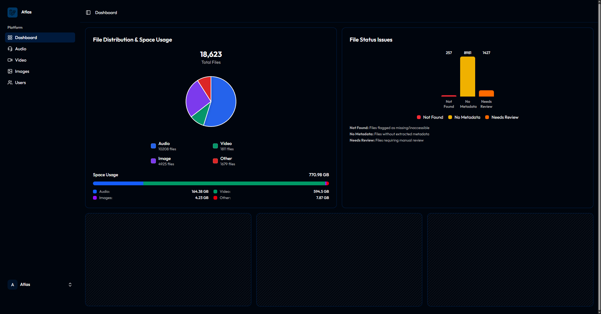
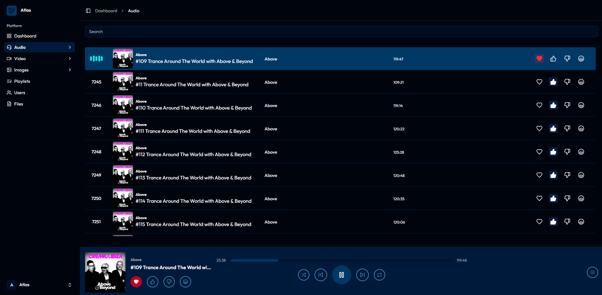

# ATLAS

[](https://opensource.org/licenses/MIT)
[](https://laravel.com)
[](https://vuejs.org)
[](https://php.net)
[](https://typescriptlang.org)

ATLAS is an open-source self-hosted media server and streaming platform for managing your digital media collection. Built with Laravel and Vue.js, ATLAS provides automated metadata extraction, file organization, and a web interface for streaming personal music, videos, and images.

Designed for users who want to host their own media server without relying on cloud services.

## Key Features

- **CivitAI Enhanced Browsing**: Intelligent content curation with automated filtering and efficient navigation
- **Audio-First Design**: Optimized for music libraries with full metadata support
- **AI-Powered Organization**: Automated file categorization and tagging
- **Search**: Powered by Typesense for full-text search across metadata
- **Responsive Design**: Works on desktop, tablet, and mobile devices
- **Self-Hosted**: Your data remains on your server
- **Modern Tech Stack**: Laravel 12, Vue.js 3, TypeScript, Tailwind CSS
- **Multi-User Support**: User management with admin controls
- **Analytics Dashboard**: Library statistics and health monitoring

## Core Features

### CivitAI Enhanced Browsing
- **Intelligent Content Filtering**: Automatically excludes previously viewed or interacted content from feed
- **Persistent Interaction Tracking**: Saves user reactions (likes, dislikes, blacklists) locally for personalized curation
- **Automated Pagination**: Auto-advance through pages with intelligent skipping of fully-viewed content
- **Masonry Layout**: Infinite scroll grid layout for continuous content discovery
- **Keyboard Shortcuts**: Alt+Click for like/download, Alt+Right-Click for blacklist operations
- **Full-Screen Navigation**: Arrow key navigation with immediate reaction feedback and content removal

### Audio Library Management
- **Automated Metadata Extraction**: Processes audio files to extract ID3v1/ID3v2 tags, cover art, and technical information
- **File Organization**: Automatically organizes files by artists, albums, and metadata
- **Cover Art Management**: Extracts and manages album artwork with deduplication
- **File Status Tracking**: Monitors missing files, metadata extraction status, and files requiring review

### Search and Discovery
- **Full-Text Search**: Powered by Typesense for search across metadata
- **Faceted Browsing**: Filter by artists, albums, years, genres, and file properties
- **Audio-Only Results**: Filters ensure only playable audio content is displayed

### Streaming and Playback
- **Direct Audio Streaming**: Stream audio files directly from your library
- **Rating System**: Rate and organize tracks with love/like/dislike options
- **Listen Tracking**: Keep track of what you've listened to

### Dashboard and Analytics
- **File Statistics**: Visual breakdown of library composition and storage usage
- **Health Monitoring**: Track files needing attention (missing, no metadata, review required)
- **Storage Analysis**: View storage consumption by file type

### User Management
- **Multi-User Support**: User registration and authentication
- **Admin Controls**: Super admin role for user and system management
- **Individual Preferences**: Personal ratings and listening history

## Technology Stack
- **Backend**: Laravel 12 (PHP 8.2+)
- **Frontend**: Vue.js 3 with TypeScript and Inertia.js
- **UI Framework**: Tailwind CSS 4 with Reka UI components
- **Search Engine**: Typesense with Laravel Scout (optional)
- **Queue System**: Laravel Queues for background processing
- **Metadata Processing**: PHP-FFMpeg for audio file analysis
- **Authentication**: Laravel Breeze with Inertia.js
- **Testing Framework**: PEST for PHP testing
- **Additional Libraries**: wyxos/harmonie for enhanced functionality

## Installation

### Prerequisites
- **PHP 8.2+** with extensions: `mbstring`, `xml`, `json`, `gd`
- **Composer** for PHP dependency management
- **Node.js** and npm for frontend assets
- **Database**: SQLite (default), MySQL 8.0+, or PostgreSQL 13+
- **Queue Worker**: Database queues (default) or Redis for job queuing
- **Search Engine**: Typesense server for full-text search (optional)
- **Storage**: Local file system or cloud storage for media files

### Setup Steps

1. **Clone the repository**
   ```bash
   git clone https://github.com/wyxos/atlas.git
   cd atlas
   ```

2. **Install PHP dependencies**
   ```bash
   composer install
   ```

3. **Install JavaScript dependencies**
   ```bash
   npm install
   ```

4. **Environment configuration**
   ```bash
   cp .env.example .env
   php artisan key:generate
   ```

5. **Configure services in `.env`**
   ```env
   # Database (SQLite is default, or configure MySQL/PostgreSQL)
   DB_CONNECTION=sqlite
   # For MySQL/PostgreSQL, uncomment and configure:
   # DB_CONNECTION=mysql
   # DB_HOST=127.0.0.1
   # DB_DATABASE=atlas
   # DB_USERNAME=your_username
   # DB_PASSWORD=your_password
   
   # Queue (database is default)
   QUEUE_CONNECTION=database
   
   # Optional: User registration
   REGISTRATION_ENABLED=true
   
   # Optional: Typesense Search (if using full-text search)
   # SCOUT_DRIVER=typesense
   # TYPESENSE_API_KEY=your_typesense_key
   # TYPESENSE_HOST=localhost
   # TYPESENSE_PORT=8108
   ```

6. **Run database migrations**
   ```bash
   php artisan migrate
   ```

7. **Build frontend assets**
   ```bash
   npm run dev  # or npm run build for production
   ```

8. **Start the queue worker** (separate terminal)
   ```bash
   php artisan queue:work
   ```

9. **Start the development server**
   ```bash
   php artisan serve
   ```

## Usage

### Adding Audio Files to Your Library

1. **Add files to your storage location** (configured in `.env`)
2. **Extract metadata from audio files**:
   ```bash
   # Process all audio files
   php artisan files:extract-metadata
   
   # Process a specific file
   php artisan files:extract-metadata --file=123
   ```

3. **Translate extracted metadata**:
   ```bash
   # Translate all extracted metadata
   php artisan files:translate-metadata
   
   # Force reprocessing of existing metadata
   php artisan files:translate-metadata --force
   
   # Process a specific file
   php artisan files:translate-metadata --file=123
   ```

### Administrative Commands

1. **Create admin user**:
   ```bash
   # Create admin with email (password will be generated)
   php artisan make:admin admin@example.com
   
   # Create admin with specific password
   php artisan make:admin admin@example.com --password=yourpassword
   ```

2. **Database management**:
   ```bash
   # Create database backup
   php artisan db:backup
   
   # Push database to remote server
   php artisan db:push-to-remote hostname /local/path /remote/path
   
   # Pull database from remote server
   php artisan db:pull-from-remote hostname /remote/path /local/path
   
   # Dry run (see what would happen without executing)
   php artisan db:push-to-remote hostname /local/path /remote/path --dry-run
   ```

3. **File management**:
   ```bash
   # Check file existence and integrity
   php artisan files:check-existence
   
   # Scan and sync files to ATLAS
   php artisan files:sync-to-atlas
   
   # Scan ATLAS files
   php artisan files:scan-atlas
   ```

### Development Commands

- **Start development environment**: `composer run dev` (runs server, queue worker, and vite concurrently)
- **Run with SSR**: `composer run dev:ssr` (includes SSR server and log monitoring)
- **Run tests**: `composer run test` or `php artisan test`
- **Watch frontend changes**: `npm run dev`
- **Build for production**: `npm run build`
- **Build with SSR**: `npm run build:ssr`
- **Code formatting**: `npm run format` (Prettier)
- **Code linting**: `npm run lint` (ESLint)
- **Queue worker**: `php artisan queue:work` (if running manually)

## Roadmap

- [ ] **Playlist Management**: Create and manage custom playlists
- [ ] **Enhanced Audio Player**: Improved playback controls and queue management
- [ ] **Batch Operations**: Bulk metadata editing and file operations
- [ ] **Docker Support**: Containerized deployment options
- [ ] **Metadata Editing**: In-app metadata correction and enhancement
- [ ] **Plugin System**: Extensible architecture for custom features

## Screenshots


*ATLAS Dashboard showing file statistics and distribution*

*Audio player interface with playback controls and metadata*

## Contributing

Contributions are welcome! Please feel free to submit a Pull Request.

## Support

- **[Report Issues](https://github.com/wyxos/atlas/issues)** - Bug reports and feature requests
- **[Website](https://wyxos.com)** - More information about Wyxos

---

## License

ATLAS is open-source software licensed under the [MIT License](LICENSE). You're free to use, modify, and distribute this software according to the license terms.

---

## Acknowledgments

- Created by [Wyxos](https://wyxos.com)
- Built with [Laravel](https://laravel.com/) and [Vue.js](https://vuejs.org/)
- UI components from [Shadcn Vue](https://www.shadcn-vue.com/)
- Search powered by [Typesense](https://typesense.org/)

---

<div align="center">

**[Back to Top](#atlas)**

**Open Source Self-Hosted Media Server**

</div>
